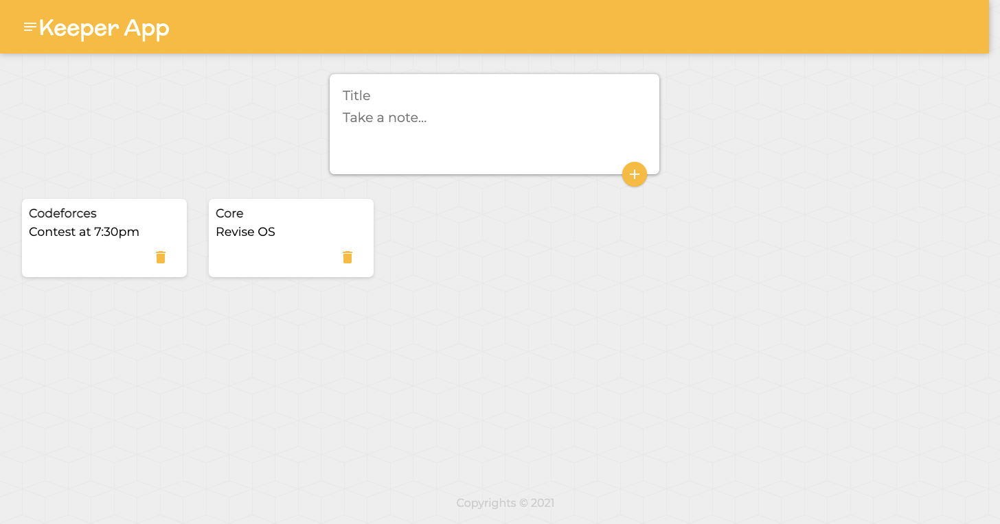

# Keeper-App

## Welcome! 👋

Thanks for checking out this repository.
This is notes taking project (Clone of Google Keep).
- Live Site URL: [Live site URL](https://utkarshgoel22.github.io/Keeper-App/)

## Table of contents

- [Overview](#overview)
  - [The challenge](#the-challenge)
  - [Screenshot](#screenshot)
- [My process](#my-process)
  - [Built with](#built-with)
  - [Useful resources](#useful-resources)

## Overview

### The challenge

- Rendering data stored in a different file
- Using React Hooks for performing various tasks
- Concept of Props in React
- Using map() and filter() function
- Using spread operator in React
 
### Screenshot

## My process

### Built with

- Semantic HTML5 markup
- CSS custom properties
- Javascript
- React
- Material UI

### Useful resources

- [MDN](https://developer.mozilla.org/en-US/) - Best resource for HTML5 and CSS3.
- [Javascript(Hindi)](https://www.youtube.com/playlist?list=PLu0W_9lII9ajyk081To1Cbt2eI5913SsL) - For learning Javascript.
- [Javascript(English)](https://www.youtube.com/watch?v=PoRJizFvM7s) - For learning callbacks, Promises, Async, Await.
- [React](https://reactjs.org/) - React Documentation
- [Create React App](https://create-react-app.dev/docs/getting-started/) - Modern build setup with no configuration.